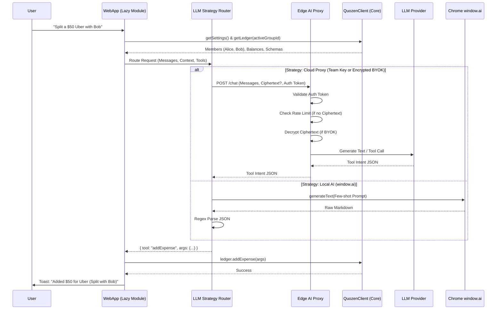

# Agentic UI Architecture

## Request Execution Flow

Below is the workflow of how the client-side Agent orchestrates RAG and interacts with the LLM routing strategies:

```mermaid
sequenceDiagram
    participant User
    participant App as WebApp (Lazy Module)
    participant Router as LLM Strategy Router
    participant Proxy as Edge AI Proxy
    participant Core as QuozenClient (Core)

    User->>App: "Split a $50 Uber with Bob"
    
    %% RAG Context Gathering
    App->>Core: getSettings() & getLedger(activeGroupId)
    Core-->>App: Members (Alice, Bob), Balances, Schemas
    
    App->>Router: Route Request (Messages, Context, Tools)
    
    alt Strategy: Cloud Proxy (Team Key or Encrypted BYOK)
        Router->>Proxy: POST /chat (Messages, Ciphertext?, Auth Token)
        Proxy->>Proxy: Validate Auth Token
        Proxy->>Proxy: Check Rate Limit (if no Ciphertext)
        Proxy->>Proxy: Decrypt Ciphertext (if BYOK)
        Proxy->>LLM Provider: Generate Text / Tool Call
        LLM Provider-->>Proxy: Tool Intent JSON
        Proxy-->>Router: Tool Intent JSON
    else Strategy: Local AI (window.ai)
        Router->>Chrome window.ai: generateText(Few-shot Prompt)
        Chrome window.ai-->>Router: Raw Markdown
        Router->>Router: Regex Parse JSON
    end
    
    %% Execution Phase
    Router-->>App: { tool: "addExpense", args: {...} }
    App->>Core: ledger.addExpense(args)
    Core-->>App: Success
    App->>User: Toast: "Added $50 for Uber (Split with Bob)"
```
