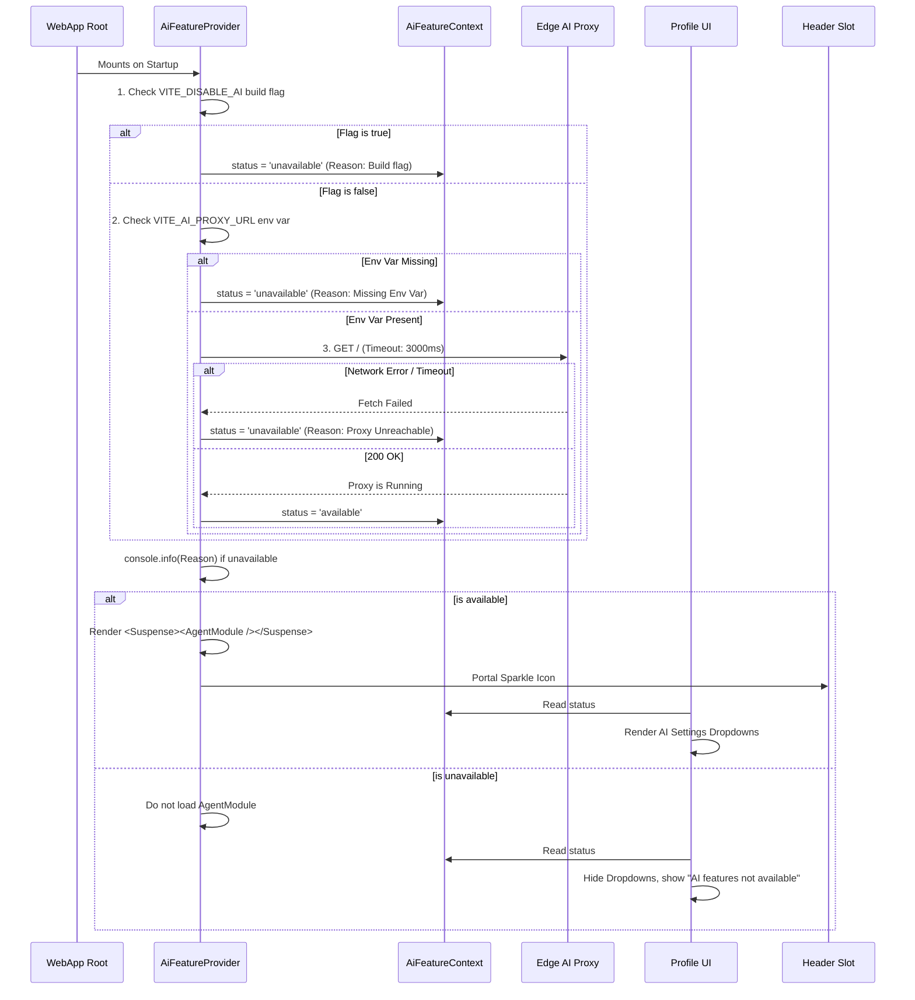

# AI Pre-flight Checklist Architecture

## Request Execution Flow

```mermaid
sequenceDiagram
    participant App as WebApp Root
    participant Provider as AiFeatureProvider
    participant Context as AiFeatureContext
    participant Proxy as Edge AI Proxy
    participant Profile as Profile UI
    participant Header as Header Slot

    App->>Provider: Mounts on Startup
    Provider->>Provider: 1. Check VITE_DISABLE_AI build flag
    alt Flag is true
        Provider->>Context: status = 'unavailable' (Reason: Build flag)
    else Flag is false
        Provider->>Provider: 2. Check VITE_AI_PROXY_URL env var
        alt Env Var Missing
            Provider->>Context: status = 'unavailable' (Reason: Missing Env Var)
        else Env Var Present
            Provider->>Proxy: 3. GET / (Timeout: 3000ms)
            alt Network Error / Timeout
                Proxy-->>Provider: Fetch Failed
                Provider->>Context: status = 'unavailable' (Reason: Proxy Unreachable)
            else 200 OK
                Proxy-->>Provider: Proxy is Running
                Provider->>Context: status = 'available'
            end
        end
    end

    Provider->>Provider: console.info(Reason) if unavailable

    alt is available
        Provider->>Provider: Render <Suspense><AgentModule /></Suspense>
        Provider->>Header: Portal Sparkle Icon
        Profile->>Context: Read status
        Profile->>Profile: Render AI Settings Dropdowns
    else is unavailable
        Provider->>Provider: Do not load AgentModule
        Profile->>Context: Read status
        Profile->>Profile: Hide Dropdowns, show "AI features not available"
    end
```
