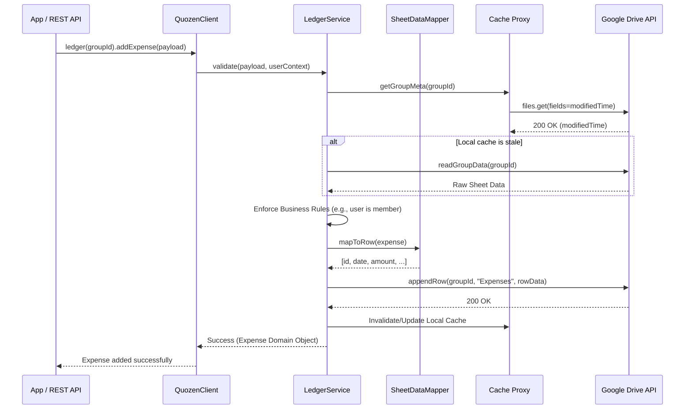

# Core Logic Architecture

## Request Execution Flow

Below is the standard workflow of adding data (e.g., an Expense) using the completely decoupled `@quozen/core` QuozenClient.

```mermaid
sequenceDiagram
    participant Client as App / REST API
    participant SDK as QuozenClient
    participant Ledger as LedgerService
    participant Mapper as SheetDataMapper
    participant Cache as Cache Proxy
    participant Drive as Google Drive API

    Client->>SDK: ledger(groupId).addExpense(payload)
    SDK->>Ledger: validate(payload, userContext)
    
    %% Authorization & State check
    Ledger->>Cache: getGroupMeta(groupId)
    Cache->>Drive: files.get(fields=modifiedTime)
    Drive-->>Cache: 200 OK (modifiedTime)
    
    %% Cache Hit/Miss logic abstracted
    alt Local cache is stale
        Ledger->>Drive: readGroupData(groupId)
        Drive-->>Ledger: Raw Sheet Data
    end

    Ledger->>Ledger: Enforce Business Rules (e.g., user is member)
    Ledger->>Mapper: mapToRow(expense)
    Mapper-->>Ledger: [id, date, amount, ...]
    
    %% Write Operation
    Ledger->>Drive: appendRow(groupId, "Expenses", rowData)
    Drive-->>Ledger: 200 OK
    
    Ledger->>Cache: Invalidate/Update Local Cache
    Ledger-->>SDK: Success (Expense Domain Object)
    SDK-->>Client: Expense added successfully
```
