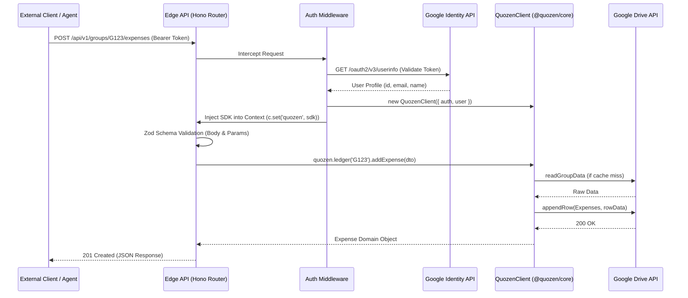

# Edge REST API Architecture

## Request Flow

This diagram illustrates how a third-party application or AI Agent communicates with Quozen's edge network, resolves Google OAuth authentication statically at the edge, and triggers the core logic.

